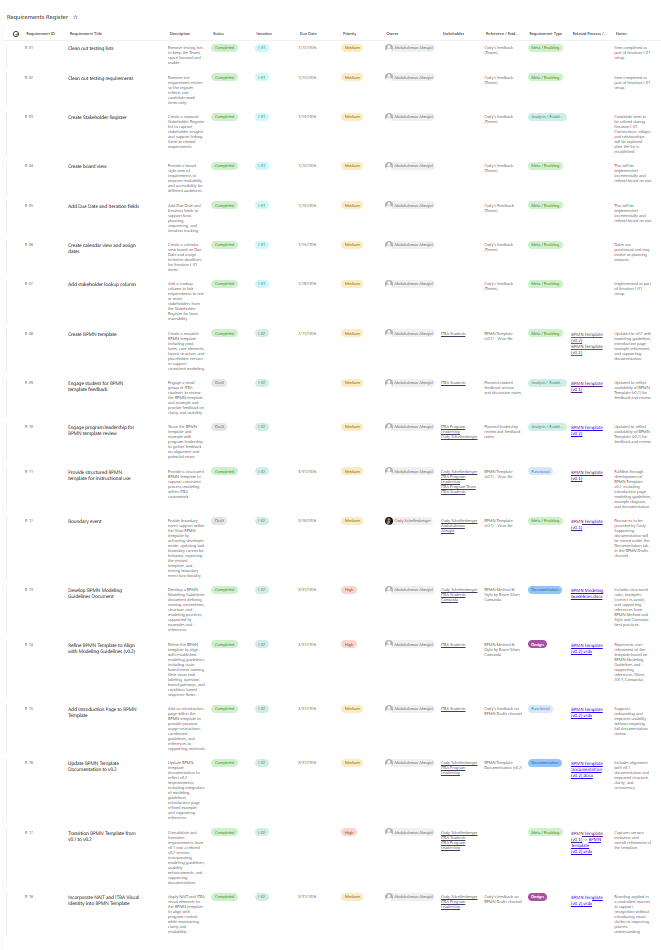
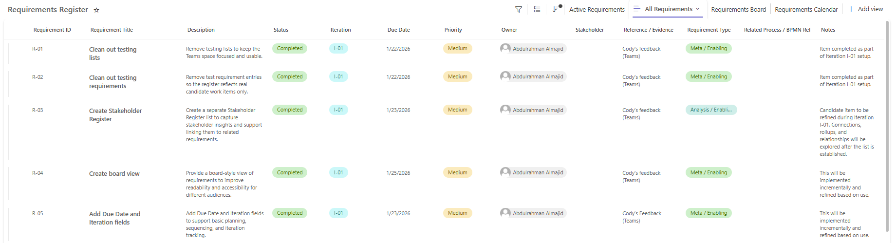
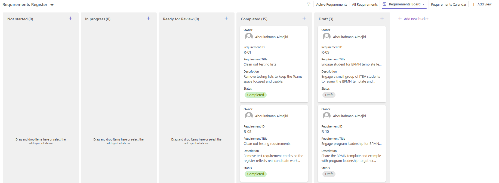
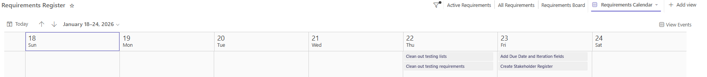
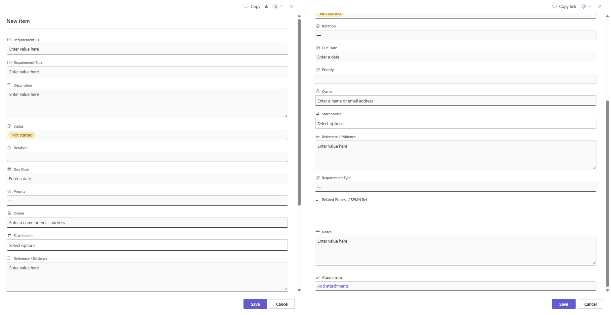

# SharePoint-based Requirements Register using Microsoft Lists in Teams

## Overview

This project presents a Requirements Register built using Microsoft Lists in Teams, backed by SharePoint. It is designed to support structured requirement tracking, stakeholder linkage, and iterative project development.

It was developed as part of the ITBA BPMN Template initiative and evolved from an initial setup into a more structured and reusable system aligned with business analysis practices.

---

## Problem

Many student and project teams lack a simple, structured way to manage requirements, stakeholders, and iteration progress using accessible tools.

Common challenges include:
- Unstructured requirement tracking
- Limited visibility of stakeholders
- No clear iteration or prioritization structure
- Inconsistent organization across projects

---

## Solution

This project provides a Microsoft List-based system that enables:

- Structured requirement tracking
- Stakeholder linkage using lookup fields
- Iteration-based organization
- Clear prioritization and status management
- Multiple views to support different perspectives

The goal is to create a reusable and understandable solution that can be applied in both academic and organizational contexts.

---

## Target Users

- Business Analysis students  
- Project teams  
- Internal organizational teams using Microsoft Lists  

---

## Key Features

- Requirement ID tracking (R-01, R-02, etc.)
- Status management (Draft, Completed, etc.)
- Iteration tracking (I-01, I-02)
- Priority classification
- Stakeholder linkage via lookup fields
- Notes and references for traceability
- Multiple views:
  - List view  
  - Board view  
  - Calendar view  

---

## List Structure

The Microsoft List includes the following key fields:

- Requirement ID  
- Requirement Title  
- Description  
- Status  
- Iteration  
- Due Date  
- Priority  
- Owner  
- Stakeholders (Lookup)  
- Related Process / BPMN Reference  
- Requirement Type  
- Notes  

Detailed structure is available in the `/docs` folder.

---

## Setup Instructions

This solution can be created via Microsoft Teams (recommended) or directly in SharePoint.

To recreate this solution:

1. Create a new Microsoft List (via Teams or SharePoint)  
2. Add columns based on the structure described in `/docs/list-structure.md`  
3. Configure views:  
   - List view for standard tracking  
   - Board view for status-based grouping  
   - Calendar view based on due dates  
4. Create or link a Stakeholder Register list  
5. Configure lookup relationships between lists  

---

## Documentation

Detailed documentation is available in the `/docs` folder:

- overview.md — project background and context  
- list-structure.md — column definitions  
- setup-guide.md — full setup instructions  
- csv-setup-guide.md — CSV-based setup method  

---

## Screenshots

See the `/screenshots` folder for examples of the working solution, including:

### List View Overview

### List View Detail

### Board View

### Calendar View

### Requirement Form

---

## Project Context

This solution was developed alongside a BPMN Template project that focuses on improving process modeling consistency and clarity.

The Requirements Register supports this work by providing a structured way to manage requirements and track iterative improvements.

---

## Template Export Note

Due to SharePoint environment and permission limitations, exporting the list as a template (.stp) may not be available in all cases.

This solution is designed to be fully recreated using the provided documentation and setup guide, ensuring it can be implemented across different environments without relying on template export functionality.

---

## Future Improvements

- Explore export as a reusable SharePoint template, depending on environment support  
- Integration with BPMN modeling workflows  
- Enhanced automation using Power Automate  
- Improved reporting and dashboards  

---
